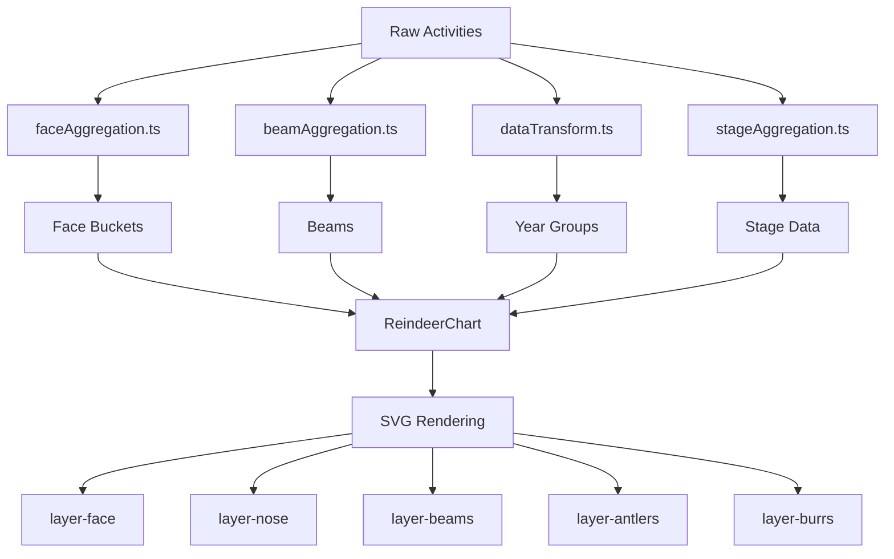

# AGENTS.md

This file provides the definitive guidance to agents when working with code in this repository. It consolidates rules from all project contexts.

## Commands

- **Dev Server**: `npm run dev` (Vite)
- **Build (app)**: `npm run build` (tsc + vite build)
- **Build (library)**: `npm run build:lib` (vite library build + tsc declarations)
- **Pack**: `npm run pack:local` (build:lib + npm pack)
- **Lint**: `npm run lint` (eslint)
- **Testing**: **No automated test runner (Vitest/Jest) is configured.**

## Testing & Visual TDD Strategy

Since there is no automated test runner, all testing follows **Visual TDD**:

1.  **Red**: Create or identify a scenario in `src/components/ReindeerExplorer/mockData.ts` and `ReindeerExplorer.tsx` that demonstrates the missing feature or bug. Verify it fails to render correctly in the browser.
2.  **Green**: Implement logic in `ReindeerChart` until the specific scenario renders correctly.
3.  **Refactor**: Clean up code while ensuring the visual output remains stable.

## Visualization Architecture

### Component Layering

The visualization follows a specific layering order defined in `design/reindeer-root.md`:

1.  **Face** (Background/Base)
2.  **Nose**
3.  **Beams**
4.  **Antlers**
5.  **Burr**

### Multiple Vertical Scales System

The visualization implements a **3-tier vertical scale system** to ensure proper separation between activities and opportunities:

```
┌─────────────────────────────────────────────────────────┐
│                   Outside Total Scale                  │
│              (Abstract continuous scale)               │
│                                                       │
│  ┌─────────────────────────────────────────────────┐  │
│  │      Inside Activities Scale (Time Scale)       │  │
│  │         - Configurable proportion              │  │
│  │         - Default: 50% of total height       │  │
│  │         - Earliest activity at top            │  │
│  │         - Latest activity at bottom           │  │
│  └─────────────────────────────────────────────────┘  │
│                                                       │
│  ┌─────────────────────────────────────────────────┐  │
│  │     Inside Opportunities Scale (Time Scale)     │  │
│  │         - Remaining proportion                │  │
│  │         - Default: 50% of total height       │  │
│  │         - Earliest opportunity at top         │  │
│  │         - Latest opportunity at bottom        │  │
│  └─────────────────────────────────────────────────┘  │
│                                                       │
└─────────────────────────────────────────────────────────┘
```

**Key Properties:**

- Activities always render above opportunities (past events precede future close dates)
- Each section maintains its own time padding
- Burr connections are the only visual elements that cross between scales
- Configurable via `activitiesHeightRatio` prop (0.0 to 1.0, default 0.5)

### Constrained Face Width

The **face** (opportunity bars) is constrained to be narrower than the **antlers** (beams) to create a realistic reindeer appearance:

- Configurable via `faceWidthRatio` prop (0.0 to 1.0, default 0.6)
- Face is centered within the available width
- Beams span the full available width
- Visual effect: antlers extend beyond the face on both sides

### Data Transformation Architecture

The core architectural challenge is mapping the `activity_example.json` schema to the `ReindeerChart` component's internal state. This is handled through three utility modules:

1. **`src/utils/faceAggregation.ts`** - Pure logic for face layer data:

   - `extractUniqueOpportunities()` - Deduplicates opportunities by ID
   - `groupOpportunitiesByPeriod()` - Groups by month or quarter
   - `calculateFaceBuckets()` - Creates FaceBucket structures
   - `calculateStackedOpportunities()` - Computes positioning for stacked bars

2. **`src/utils/beamAggregation.ts`** - Pure logic for antler/beam layer data:

   - `groupActivitiesByOpportunity()` - Groups activities by opportunity ID
   - `calculateBeamPositions()` - Implements beam displacement algorithm with alternating ordinal positions

3. **`src/utils/stageAggregation.ts`** — Pure logic for nose layer data:
   - `aggregateStageData()` — Deduplicates opportunities by ID using latest activity timestamp, aggregates revenue and activity counts by stage

4. **`src/utils/scales.ts`** — Layout calculation and D3 scale creation:
   - `calculateLayout()` — Computes layout dimensions from chart configuration
   - `updateLayoutWithBuckets()` — Adjusts row heights based on bucket count
   - `createScales()` — Creates time and revenue D3 scales
   - `createBeamXScale()` — Creates beam horizontal positioning scale

5. **`src/utils/safeRender.ts`** — Error handling wrapper for D3 layer rendering

6. **`src/utils/activityShape.ts`** — Maps activity types to SVG path shapes

7. **`src/utils/countryFlag.ts`** — Converts ISO country codes to flag emoji

8. **`src/utils/dataTransform.ts`** - Shared transformation utilities:
   - `groupOpportunitiesByMonth()` - Creates YearGroup structures for rendering
   - `getMaxRevenue()` - Calculates maximum revenue for scale normalization
   - `getMonthName()` - Utility for month label display

9. **`src/utils/validateActivities.ts`** — Runtime validation for Activity[] input:
   - `validateActivities()` — Validates unknown input against the Activity schema, returns typed data or error messages

### Responsiveness

The chart must be designed to re-calculate D3 scales and positions when container dimensions change, handled via `useEffect` in `ReindeerChart.tsx`.

## React + D3 + Tailwind Architecture

The project follows the **"React wrapper, D3 engine"** pattern.

### 1. Roles & Responsibilities

| Tech         | Role            | Responsibility                                                                                                                   |
| :----------- | :-------------- | :------------------------------------------------------------------------------------------------------------------------------- |
| **React**    | **The Boss**    | Holds State (Data, Dimensions, Hover). Renders container DOM (`<div>`, `<svg>`, `<g>`). Handsoff control of SVG internals to D3. |
| **D3.js**    | **The Engine**  | Math (Scales, Shapes) and DOM Manipulation (Enter/Update/Exit, Transitions). Renders the _dynamic_ nodes inside React's layers.  |
| **Tailwind** | **The Stylist** | Defines aesthetics (Colors, Typography, Strokes) via classes.                                                                    |

### 2. The "D3-Effect" Methodology

**Rule 1: DOM Ownership (The Black Box)**

- React renders the `<svg ref={ref}>` and high-level `<g id="layer-name">` containers.
- React **NEVER** renders individual data elements (`<circle>`, `<path>`, `<rect>`) directly.
- D3 takes full control of the SVG internals within a `useEffect`.

**Rule 2: Styling (Separation of Concerns)**

- **Geometry (D3 attributes):** `x`, `y`, `r`, `d`, `transform`.
- **Aesthetics (Tailwind classes):** `fill`, `stroke`, `opacity` applied via D3: `.attr('class', 'fill-blue-500 transition-colors')`.
- _Exception:_ Dynamic, data-driven colors (e.g., heatmaps) use D3 attributes.

**Rule 3: Interaction Bridge**

- **Events:** D3 attaches listeners (`.on('click', ...)`).
- **Logic:** Listeners invoke React callbacks passed as props (`onClick={() => setSelection(d.id)}`).

## Design & Implementation Guidelines

- **Design Specs**: Consult `design/reindeer-grammar.md` for specific rules on how activities are mapped to the visualization (e.g., beam displacement, antlers).
- **Implementation Guide**: Follow the **Visual TDD** strategy described above in the Testing & Visual TDD Strategy section.
- **Project Structure**:
  - `design/`: Visual and architectural specifications.
  - `src/components/ReindeerChart/`: Core visualization logic.
  - `src/components/ReindeerExplorer/`: Interactive exploration and visual verification tool.

## Coding Standards

- **D3/React Lifecycle**: **CRITICAL**: Always include `svg.selectAll("*").remove()` at the beginning of the `useEffect` hook in `ReindeerChart` to prevent duplicate elements on re-renders/HMR.
- **Styling (Tailwind v4)**:
  - Use utility classes directly in `className` for SVG elements where possible (e.g., `fill-white`, `stroke-gray-600`, `text-xl`).
  - **Debugging**: If styles aren't applying, check if classes are being dynamically generated in a way that bypasses the Tailwind JIT scanner.
- **Imports**: Follow the mandatory order:
  1.  React
  2.  Third-party libraries (d3)
  3.  Local modules (`../../types`, `./components`)

## Component Configuration

The `ReindeerChart` component accepts the following configuration props:

| Prop                    | Type       | Default | Description                                                                                                |
| ----------------------- | ---------- | ------- | ---------------------------------------------------------------------------------------------------------- |
| `width`                 | number     | 800     | Width of SVG container in pixels                                                                           |
| `height`                | number     | 600     | Height of SVG container in pixels                                                                          |
| `data`                  | Activity[] | []      | Array of activities to visualize                                                                           |
| `faceWidthRatio`        | number     | 0.6     | Proportion of available width for face (0.1 to 1.0). Face is centered, antlers extend beyond.              |
| `activitiesHeightRatio` | number     | 0.5     | Proportion of available height for activities section (0.1 to 0.9). Activities render above opportunities. |
| `focusedPeople`         | Set\<string\> | undefined | Set of participant names to highlight. When set, matching beams render at full opacity, others dim.     |
| `focusMode`             | "or" \| "and" | "or"  | Focus matching mode. "or": highlight beams with any focused person. "and": only beams with all focused people. |

**Validation**: Both `faceWidthRatio` and `activitiesHeightRatio` are automatically clamped to valid ranges.

## Visualization Layers

The chart renders five distinct layers in order:

1. **`layer-face`** (`<g id="layer-face">`)

   - Chart title and face boundary
   - Month labels
   - Opportunity bucket backgrounds
   - Stacked opportunity bars (colored by stage)
   - Revenue labels

2. **`layer-nose`** (`<g id="layer-nose">`)

   - Pipeline summary bars showing revenue by stage
   - Full pipeline bar and focused pipeline bar (when people focus is active)

3. **`layer-beams`** (`<g id="layer-beams">`)

   - Monthly timeline gridlines
   - Vertical beam lines connecting activity nodes

4. **`layer-antlers`** (`<g id="layer-antlers">`)

   - Activity nodes (shapes vary by activity type: circle, diamond, square, triangle, star)
   - Crown pills (opportunity name, revenue, participant details)

5. **`layer-burrs`** (`<g id="layer-burrs">`)
   - Horizontal dashed lines connecting each beam to its opportunity

## Data Flow



## Debugging

- **Mock Data**: Use `src/components/ReindeerExplorer/mockData.ts` to tweak or add data scenarios for debugging.
- **D3 Selections**: When inspecting SVG elements, remember that D3 selections are often cleared and redrawn completely on React state changes.


