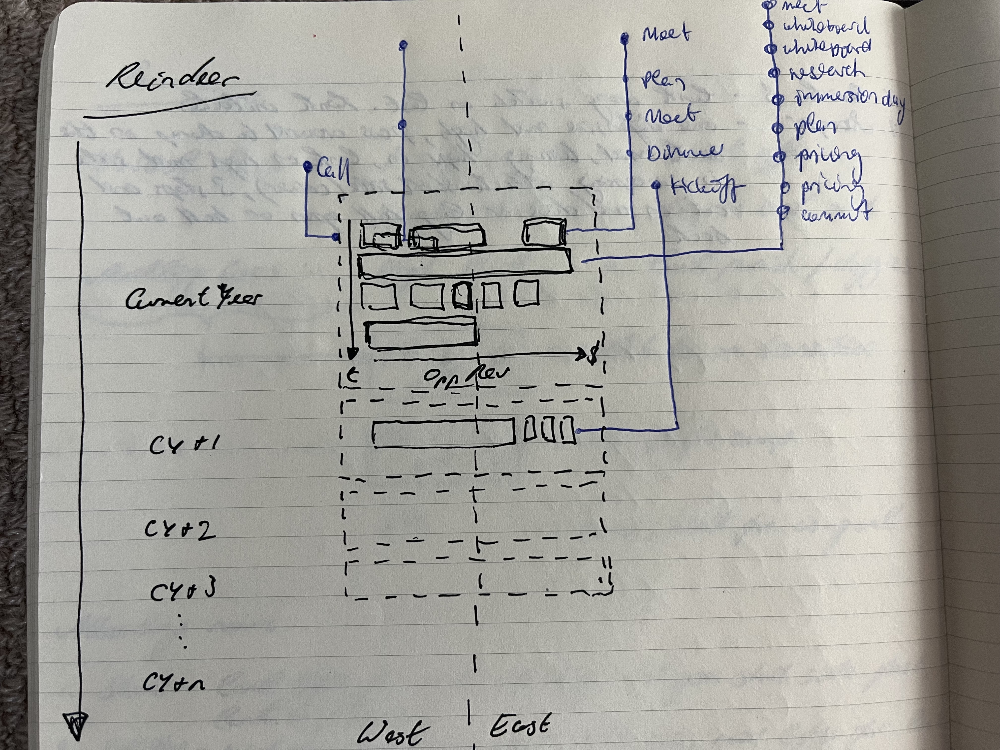
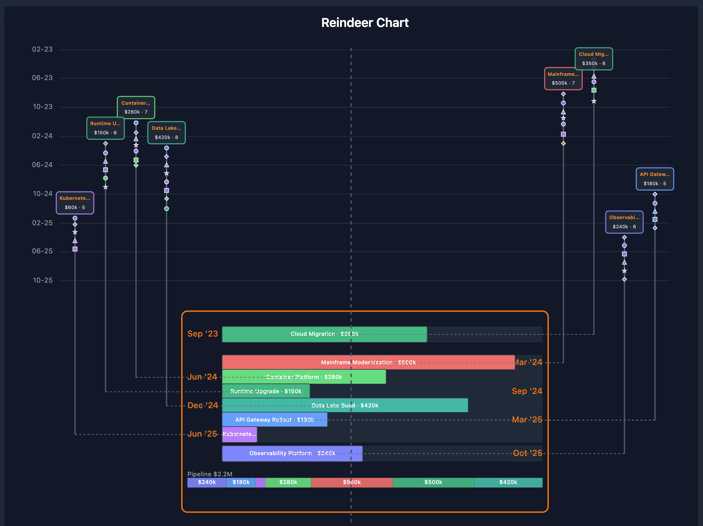
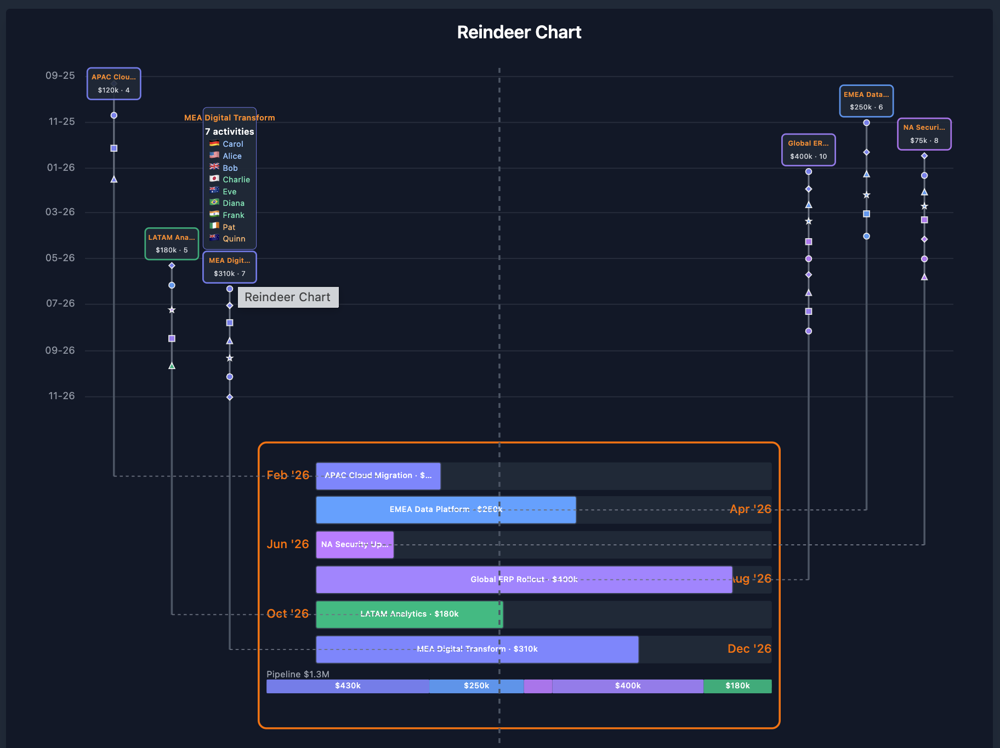
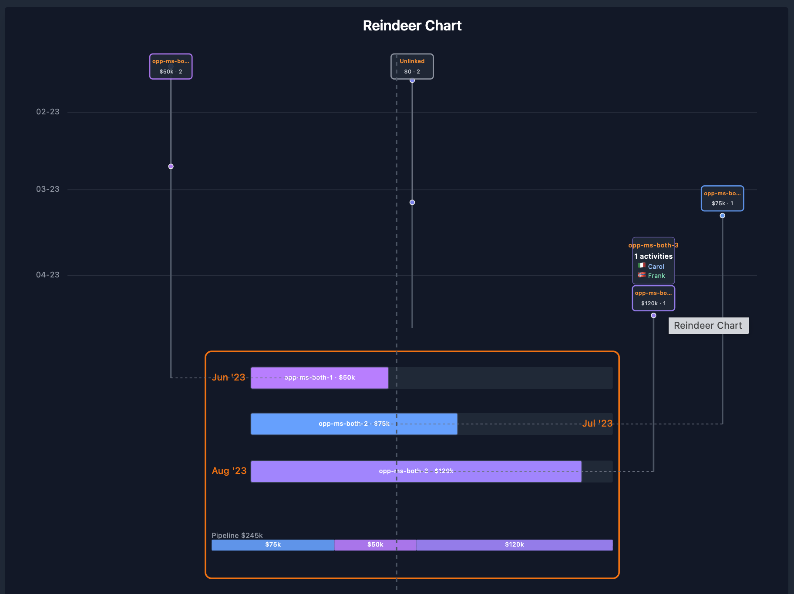

# Reindeer

[](https://github.com/markstownsend/reindeer/actions/workflows/ci.yml)
[](https://unlicense.org/)

A complex visualization component which looks like a reindeer.

## Overview

The **Reindeer Chart** is a vertical timeline visualization named for its resemblance to a reindeer head. It maps activities over time on the antlers and connects them via a burr to the head and face. The face contains opportunities in stacked horizontal bars. Time advances as you go North to South on the chart. Navigation East to West in the face reflects the revenue size of the opportunity. The first use case that motivated the need for the visualization was in enterprise software sales where you have a large enterprise sales team pursuing many opportunities at a large customer. It is hard to see what everyone is working on, who is working on what together, who owns what opportunity, what stage the opportunity is at, how much work has gone into it and various other things.



## Features

- **Multi-Year Timeline**: Visualize activities and opportunities across multiple years
- **Activity Tracking**: Track sales activities with participant information (sellers and customers)
- **Opportunity Staging**: Display opportunities at different stages (Prospect, Qualified, Technical Validation, Launched, etc.)
- **Revenue Visualization**: Opportunity size reflects revenue, normalized to the largest opportunity
- **Flexible Layout**: Configure face width ratio and activities height ratio for different visualizations
- **Bound & Free Activities**: Support for activities linked to specific opportunities (bound) and standalone activities (free)

### Visual Examples

#### Multi-Year Portfolio

Shows 8 IT opportunities across 2023–2025 with different stages and many activities per timeline:



#### Bound Activities

Activities that are directly linked to specific opportunities, shown as vertical beams connecting to opportunity bars:



#### Mixed Bound and Free Activities

A combination of bound activities (connected to opportunities) and free activities (standalone):



## Installation

```bash
npm install
```

## Usage

### Basic Component

```tsx
import { ReindeerChart } from "./components/ReindeerChart";
import type { Activity } from "./types/reindeer";

const myData: Activity[] = [
  {
    id: "a1",
    timestamp: "2023-10-01T09:00:00Z",
    type: "meeting",
    sellers: [{ name: "Alice Smith", role: "Account Executive", country: "US" }],
    customers: [{ name: "Charlie Brown", role: "CTO", country: "JP" }],
    partners: [{ name: "Pat Quinn", role: "Implementation Consultant", country: "IE" }],
    description: "First contact",
    linkedOpportunities: [
      {
        id: "opp-101",
        name: "APAC Cloud Migration",
        closeDate: "2023-12-15",
        stage: "Prospect",
        revenue: 50000,
        stageAdjustedRevenue: 5000,
      },
    ],
  },
];

function App() {
  return (
    <ReindeerChart
      width={1000}
      height={800}
      data={myData}
      faceWidthRatio={0.6}
      activitiesHeightRatio={0.5}
    />
  );
}
```

### Component Props

| Prop                    | Type       | Default | Description                                                                                                |
| ----------------------- | ---------- | ------- | ---------------------------------------------------------------------------------------------------------- |
| `width`                 | number     | 800     | Width of SVG container in pixels                                                                           |
| `height`                | number     | 600     | Height of SVG container in pixels                                                                          |
| `data`                  | Activity[] | []      | Array of activities to visualize                                                                           |
| `faceWidthRatio`        | number     | 0.6     | Proportion of available width for face (0.1 to 1.0). Face is centered, antlers extend beyond.              |
| `activitiesHeightRatio` | number     | 0.5     | Proportion of available height for activities section (0.1 to 0.9). Activities render above opportunities. |
| `focusedPeople`         | Set\<string\> | undefined | Set of participant names to highlight. When set, matching beams render at full opacity, others dim.     |
| `focusMode`             | "or" \| "and" | "or"  | Focus matching mode. "or": highlight beams with any focused person. "and": only beams with all focused people. |

### Data Structure

```typescript
interface Activity {
  id: string;
  timestamp: string;  // ISO 8601 UTC (e.g., "2023-10-01T09:00:00Z")
  type?: string;      // "meeting" | "call" | "email" | "demo" | "workshop" (defaults to "meeting")
  sellers: Seller[];
  customers: Customer[];
  partners?: Partner[];
  description: string;
  linkedOpportunities: Opportunity[];  // Empty array = free/unlinked activity
}

interface Seller {
  name: string;
  role: string;
  country?: string;  // ISO 3166-1 alpha-2 (e.g., "US", "GB", "DE")
}

interface Customer {
  name: string;
  role: string;
  country?: string;
}

interface Partner {
  name: string;
  role: string;
  country?: string;
}

interface Opportunity {
  id: string;
  name?: string;              // Human-readable name (e.g., "APAC Cloud Migration")
  closeDate: string;          // ISO 8601 date YYYY-MM-DD
  stage: string;              // Stage at time of activity (e.g., "Prospect", "Technical Validation", "Launched")
  revenue: number;            // Absolute revenue value
  stageAdjustedRevenue: number;
}
```

#### Key Concepts

- **Activities** are the atomic unit of data. Each activity represents a sales touchpoint (meeting, call, demo, etc.) at a point in time.
- **Linked opportunities** are snapshots — the same opportunity can appear on multiple activities with different stages, reflecting how the deal progressed over time. The visualization uses this to color activity nodes by the stage at the time they occurred.
- **Free activities** (empty `linkedOpportunities` array) render on a central beam inside the face, not connected to any opportunity.
- **Country codes** enable flag emoji display (🇺🇸 🇬🇧 🇯🇵) in the Northern Terminus and hover tooltips. Optional — a dot is shown when omitted.
- **Activity type** determines the shape of the node on the beam: circle (meeting), diamond (call), square (email), triangle (demo), star (workshop). Optional — defaults to circle.
- **Opportunity name** appears in the Northern Terminus at the top of each beam. Falls back to the opportunity ID if omitted.
- **Stage** can be any string. The built-in color palette maps: Prospect (indigo), Qualified (blue), Technical Validation (purple), Business Validation (violet), Committed (green), Closed Lost (red), Launched (emerald), Completed (teal). Unknown stages render in gray.

## Visual Structure

### Layout

- **Orientation**: Vertical
- **Y-Axis**: Time (Historic start year (usually current year) → Future Years)
- **X-Axis**: Split into two domains:
  - **West** (Left side, older opportunities/ before some date cut off)
  - **East** (Right side, newer opportunities/ after some date cut off)

### Components

- **Central Axis**: A vertical dashed line separating West and East
- **Activity Field**: The section of the screen above the face where the antlers appear
  - Can scale the y-axis to be days, weeks or months in this section
  - All activities are plotted in this section of the chart
  - Contains horizontal lines indicating the time period boundaries
- **Time Blocks**:
  - Represented as rectangular regions
  - Can span multiple years
  - Located on either West or East side
  - Located in the face of the reindeer
- **Opportunities**:
  - Rectangles placed within the time blocks
  - Size determined by absolute revenue normalized to the size of the largest opportunity
- **Activities**:
  - Shapes placed in the activity field
  - Shapes are different depending on what type of activity
  - Shapes are colored differently depending on which customer actors attended
    - red for economic buyer
    - yellow for technical buyer
    - red and yellow if both attended
- **Activity Timelines aka "Beam"**:
  - Vertical lines extending Northwards from the same level as the specific opportunities that the activities relate to
  - Activities along these vertical lines depending on the date when they occurred
  - Connected to the opportunity via a horizontal line (the burr)

### Visualization Layers

The chart renders five distinct layers in order:

1. **Face** - Year labels, month labels, opportunity bucket backgrounds, stacked opportunity bars, revenue labels, and legend
2. **Nose** - Pipeline donut chart showing revenue by stage
3. **Beams** - Vertical beam edges connecting activity nodes
4. **Antlers** - Activity nodes (circles, sized by participant count) and Northern Terminus icons
5. **Burrs** - Horizontal dashed lines connecting beam bottom to opportunity center

## Development

### Scripts

```bash
# Start development server
npm run dev

# Build for production
npm run build

# Preview production build
npm run preview

# Run linter
npm run lint
```

### Test Harness

The project includes a Test Harness component for visual verification and testing:

```bash
npm run dev
```

Navigate to the test harness to:

- Switch between different datasets
- Adjust chart dimensions (width, height)
- Configure face width ratio and activities height ratio
- Visualize different scenarios (typical, large dataset, multi-year, etc.)

### Tech Stack

- **React 19** - Component framework
- **D3.js 7** - SVG rendering and data visualization
- **Tailwind CSS 4** - Styling
- **TypeScript** - Type safety
- **Vite** - Build tool and dev server

## Architecture

The visualization follows a **"React wrapper, D3 engine"** pattern:

| Tech         | Role            | Responsibility                                                                                                                    |
| :----------- | :-------------- | :-------------------------------------------------------------------------------------------------------------------------------- |
| **React**    | **The Boss**    | Holds State (Data, Dimensions, Hover). Renders container DOM (`<div>`, `<svg>`, `<g>`). Hands off control of SVG internals to D3. |
| **D3.js**    | **The Engine**  | Math (Scales, Shapes) and DOM Manipulation (Enter/Update/Exit, Transitions). Renders the _dynamic_ nodes inside React's layers.   |
| **Tailwind** | **The Stylist** | Defines aesthetics (Colors, Typography, Strokes) via classes.                                                                     |

React owns all state; D3 event listeners call back to React state setters, triggering re-renders through the standard unidirectional data flow.

### Data Transformation Pipeline

Raw `Activity[]` data is transformed before rendering by four utility modules:

- **`faceAggregation.ts`** — deduplicates opportunities, groups by time period (monthly/quarterly), computes stacked bar positions
- **`beamAggregation.ts`** — groups activities by opportunity, implements beam displacement algorithm (alternating ordinals sorted by revenue)
- **`stageAggregation.ts`** — aggregates revenue and activity counts by stage for the pipeline summary (nose)
- **`scales.ts`** — layout calculation and D3 scale creation (outside, activities, and opportunities scales)

### Multiple Vertical Scales System

The visualization implements a **3-tier vertical scale system** to ensure proper separation between activities and opportunities:

```
┌─────────────────────────────────────────────────────────┐
│                   Outside Total Scale                  │
│              (Abstract continuous scale)               │
│                                                       │
│  ┌─────────────────────────────────────────────────┐  │
│  │      Inside Activities Scale (Time Scale)       │  │
│  │         - Configurable proportion              │  │
│  │         - Default: 50% of total height       │  │
│  │         - Earliest activity at top            │  │
│  │         - Latest activity at bottom           │  │
│  └─────────────────────────────────────────────────┘  │
│                                                       │
│  ┌─────────────────────────────────────────────────┐  │
│  │     Inside Opportunities Scale (Time Scale)     │  │
│  │         - Remaining proportion                │  │
│  │         - Default: 50% of total height       │  │
│  │         - Earliest opportunity at top         │  │
│  │         - Latest opportunity at bottom        │  │
│  └─────────────────────────────────────────────────┘  │
│                                                       │
└─────────────────────────────────────────────────────────┘
```

**Key Properties:**

- Activities always render above opportunities (past events precede future close dates)
- Each section maintains its own time padding
- Burr connections are the only visual elements that cross between scales
- Configurable via `activitiesHeightRatio` prop (0.0 to 1.0, default 0.5)

### Constrained Face Width

The **face** (opportunity bars) is constrained to be narrower than the **antlers** (beams) to create a realistic reindeer appearance:

- Configurable via `faceWidthRatio` prop (0.0 to 1.0, default 0.6)
- Face is centered within the available width
- Beams span the full available width
- Visual effect: antlers extend beyond the face on both sides

## Documentation

- **Design Specs**: Consult `doc/design/reindeer-grammar.md` for specific rules on how activities are mapped to the visualization
- **Agent Rules**: See `AGENTS.md` for detailed architectural guidelines and coding standards

## Contributing

Contributions are welcome! Please read [CONTRIBUTING.md](CONTRIBUTING.md) for guidelines on how to get started.

## License

This project is released under the [Unlicense](LICENSE) — dedicated to the public domain.
