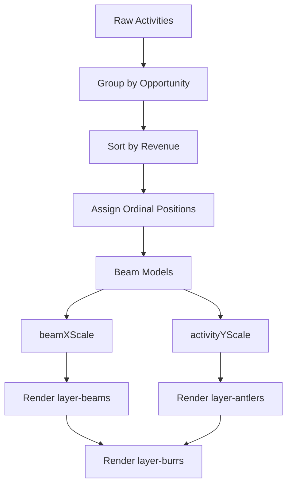

# Implementation Plan - Antlers and Beams Visualization (STA-9, STA-10, STA-11)

Implement the "Antlers" and "Beams" layers in the Reindeer visualization as defined in the project's Linear backlog.

## Reference Tasks

- **STA-9**: Implement Beam displacement and activity mapping logic (Pure Logic).
- **STA-10**: Implement Antler and Beam components (Activity Timelines) (UI).
- **STA-11**: Implement Burr connection (Beam to Opportunity link) (UI).

## Proposed Changes

### 1. Data Aggregation (`src/utils/beamAggregation.ts`) - [STA-9]

Create a new utility file to handle the complex layout logic for beams:

- `groupActivitiesByOpportunity(activities: Activity[]): Map<string, Activity[]>`
- `calculateBeamPositions(activities: Activity[]): Beam[]`
  - Logic to unique/sort all opportunities by total revenue.
  - Algorithm to assign alternating ordinals (0, -1, 1, -2, 2...) based on revenue rank.
  - Calculate vertical extents (`minDate`, `maxDate`) based on activity timestamps.

### 2. Visualization UI (`src/components/ReindeerChart/ReindeerChart.tsx`) - [STA-10, STA-11]

Update the D3 rendering logic in `ReindeerChart` to include the new layers:

- **Scales**:
  - `beamXScale`: Maps ordinal positions to horizontal pixel offsets from the center.
  - `activityYScale`: Maps timestamps to vertical pixel positions (Continuous).
- **Layers**:
  - `layer-beams`: Vertical lines representing the stem of the antler [STA-10].
  - `layer-antlers`: Activity nodes (circles) mapping size to effort [STA-10].
  - `layer-burrs`: Horizontal lines (the "burr") connecting the beam to the Face [STA-11].
- **Terminus**:
  - Northern Terminus icons for activity participants [STA-10].

### 3. Styling & Configuration

- Use `roleStyleMap` and `stageStyleMap` from `ReindeerConfig` to avoid hardcoded colors [STA-13].

## TODO List

- [x] **STA-9**: Create `src/utils/beamAggregation.ts` and implement pure logic transformation.
- [x] **STA-10**: Implement Antler and Beam D3 rendering in `ReindeerChart.tsx`.
- [x] **STA-10**: Implement Northern Terminus participant icons.
- [ ] **STA-11**: Implement Burr connection path logic and rendering.
- [ ] **STA-13**: Integrate configuration-based styling for nodes and lines.
- [x] **Visual TDD**: Create "Complex Beam Displacement" scenario in `mockData.ts` to verify layout.

## System Architecture

