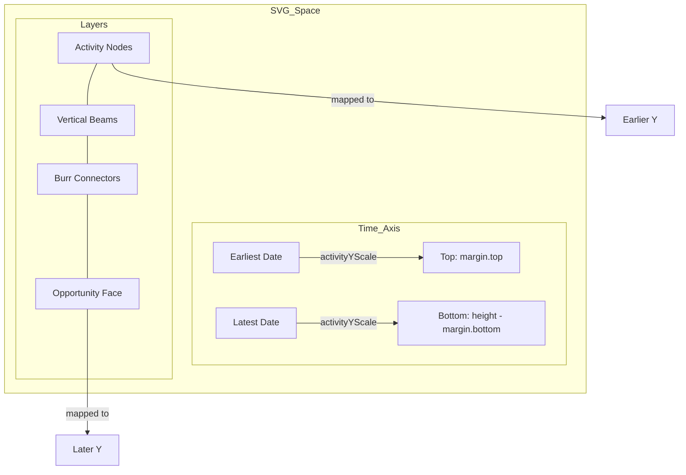

# Plan: Fix Activity/Opportunity Y-Axis Alignment and Implement Burrs

The current implementation has a coordinate system mismatch between the "Face" (Opportunities) and "Beams" (Activities), causing activities to appear in the wrong vertical order relative to their opportunities.

## Problem Analysis

- **Face Orientation**: Renders earliest buckets at the top and latest at the bottom.
- **Beam Orientation**: Currently renders latest activities at the top and earliest at the bottom (`domain([max, min])`).
- **Temporal Mismatch**: Activities (past events) should precede Close Dates (future events). If time flows Top-to-Bottom, activities should appear above their corresponding opportunities.
- **Alignment**: The Face and Beams use different logic for vertical placement, leading to drift and overlap issues.

## Proposed Solution

1. **Unify the Time Scale**: Create a single `timeScale` that covers the entire range from the earliest activity to the latest opportunity close date. This unified approach is a prerequisite for "zoom" or "fish-eye" effects.
2. **Synchronize Face and Beams**: Use this shared scale to position both the Face buckets and the activity nodes.
3. **Implement Burrs**: Draw horizontal/diagonal lines (the "burr") connecting the southern end of each beam to its associated opportunity in the Face.
4. **Foundation for Piecewise Scaling**: Implement the Y-axis mapping using a pattern that can easily be swapped for a D3 piecewise scale (or a zoom behavior) in the future to allow month-level expansion.

## Proposed Steps

### 1. Data Analysis & Scaling

- Calculate the global `minTime` (earliest activity timestamp) and `maxTime` (latest opportunity close date).
- Update `activityYScale` in `ReindeerChart.tsx` to use `domain([minTime, maxTime])` and `range([margin.top, height - margin.bottom])`.
- This ensures time flows Top (Earliest) to Bottom (Latest).

### 2. Face Rendering Update

- Modify the Face rendering loop to use the same `activityYScale` for positioning month buckets.
- Instead of manual `currentY` increments, calculate `y` based on the month's date.
- Ensure the `rowHeight` and spacing are consistent with the scale.

### 3. Beam & Antler Update

- The flipped `activityYScale` will naturally move earlier activities to the top.
- Since activities (e.g., 2023) are earlier than close dates (e.g., 2026), they will correctly appear above the Face.

### 4. Implement Burr Connections (STA-11)

- During Face rendering, store the (x, y) coordinates of each rendered opportunity.
- During Beam rendering, use these coordinates to draw the "burr" line from the bottom of the beam (`verticalExtent.max` date) to the opportunity's position.

### 5. Visual Verification

- Use `TestHarness` with `typicalDataset` and `faceMultiYearOpportunities` to verify that activities now appear above their respective opportunities and are connected by burrs.

## Mermaid Diagram of New Layout

