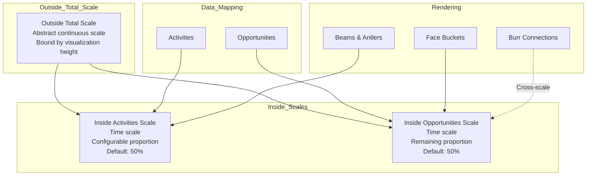

# Multiple Vertical Scales Implementation Plan

## Overview

Implement a 3-tier vertical scale system to ensure all activities are displayed before any opportunities. The visualization will be divided into two distinct vertical sections: activities (top) and opportunities (bottom).

## Architecture

### Scale Hierarchy

```
┌─────────────────────────────────────────────────────────┐
│                   Outside Total Scale                  │
│              (Abstract continuous scale)               │
│                                                       │
│  ┌─────────────────────────────────────────────────┐  │
│  │      Inside Activities Scale (Time Scale)       │  │
│  │         - Configurable proportion              │  │
│  │         - Default: 50% of total height       │  │
│  │         - Earliest activity at top            │  │
│  │         - Latest activity at bottom           │  │
│  └─────────────────────────────────────────────────┘  │
│                                                       │
│  ┌─────────────────────────────────────────────────┐  │
│  │     Inside Opportunities Scale (Time Scale)     │  │
│  │         - Remaining proportion                │  │
│  │         - Default: 50% of total height       │  │
│  │         - Earliest opportunity at top         │  │
│  │         - Latest opportunity at bottom        │  │
│  └─────────────────────────────────────────────────┘  │
│                                                       │
└─────────────────────────────────────────────────────────┘
```

### Mermaid Diagram: Scale Architecture



## Implementation Steps

### 1. Update ReindeerChart Props Interface

Add new prop for activities height proportion:

```typescript
interface ReindeerChartProps {
  width?: number;
  height?: number;
  data?: Activity[];
  faceWidthRatio?: number; // 0.0 to 1.0, default 0.6
  activitiesHeightRatio?: number; // 0.0 to 1.0, default 0.5
}
```

### 2. Calculate Scale Boundaries

Replace unified time scale with three separate scales:

```typescript
// Outside total scale: abstract continuous scale
const totalAvailableHeight = height - margin.top - margin.bottom;

// Inside activities scale: time scale
const activitiesHeight = totalAvailableHeight * activitiesHeightRatio;
const activitiesRange = [margin.top, margin.top + activitiesHeight];

// Inside opportunities scale: time scale
const opportunitiesHeight = totalAvailableHeight * (1 - activitiesHeightRatio);
const opportunitiesRange = [
  margin.top + activitiesHeight,
  height - margin.bottom,
];
```

### 3. Create Separate Time Scales

```typescript
// Activities time scale
const activityTimestamps = data.map((a) => new Date(a.timestamp));
const minActivityTime = new Date(
  Math.min(...activityTimestamps.map((d) => d.getTime())),
);
const maxActivityTime = new Date(
  Math.max(...activityTimestamps.map((d) => d.getTime())),
);
const activityTimePadding =
  (maxActivityTime.getTime() - minActivityTime.getTime()) * 0.05 || 86400000;

const activitiesTimeScale = d3
  .scaleTime()
  .domain([
    new Date(minActivityTime.getTime() - activityTimePadding),
    new Date(maxActivityTime.getTime() + activityTimePadding),
  ])
  .range(activitiesRange);

// Opportunities time scale
const opportunityCloseDates: Date[] = [];
for (const activity of data) {
  for (const opp of activity.linkedOpportunities) {
    const closeDate = new Date(opp.closeDate);
    if (!isNaN(closeDate.getTime())) {
      opportunityCloseDates.push(closeDate);
    }
  }
}
const minOppTime = new Date(
  Math.min(...opportunityCloseDates.map((d) => d.getTime())),
);
const maxOppTime = new Date(
  Math.max(...opportunityCloseDates.map((d) => d.getTime())),
);
const oppTimePadding =
  (maxOppTime.getTime() - minOppTime.getTime()) * 0.05 || 86400000;

const opportunitiesTimeScale = d3
  .scaleTime()
  .domain([
    new Date(minOppTime.getTime() - oppTimePadding),
    new Date(maxOppTime.getTime() + oppTimePadding),
  ])
  .range(opportunitiesRange);
```

### 4. Update Beam Rendering

Update beam rendering to use `activitiesTimeScale`:

```typescript
// Render beam edges using activitiesTimeScale
beamsLayer
  .selectAll(".beam-edge")
  .data(beams)
  .enter()
  .append("line")
  .attr("class", "beam-edge stroke-gray-600 stroke-2")
  .attr("x1", (d) => beamXScale(d.ordinalPosition))
  .attr("x2", (d) => beamXScale(d.ordinalPosition))
  .attr("y1", (d) => activitiesTimeScale(d.verticalExtent.min))
  .attr("y2", (d) => activitiesTimeScale(d.verticalExtent.max));

// Render activity nodes using activitiesTimeScale
sortedActivities.forEach((activity) => {
  const y = activitiesTimeScale(new Date(activity.timestamp));
  // ... render node at y position
});
```

### 5. Update Face Rendering

Update face rendering to use `opportunitiesTimeScale`:

```typescript
// Use opportunitiesTimeScale to position year labels and buckets
for (const yearGroup of yearGroups) {
  const yearStartDate = new Date(yearGroup.year, 0, 1);
  const yearY = opportunitiesTimeScale(yearStartDate);
  // ... render year label at yearY

  for (const bucket of yearGroup.buckets) {
    const bucketDate = new Date(bucket.year, bucket.month, 1);
    const bucketY = opportunitiesTimeScale(bucketDate);
    // ... render bucket at bucketY
  }
}
```

### 6. Update Burr Connections

Burr connections need to cross from activities scale to opportunities scale:

```typescript
beams.forEach((beam) => {
  const beamX = beamXScale(beam.ordinalPosition);
  const latestActivityDate = beam.verticalExtent.max;
  const beamBottomY = activitiesTimeScale(latestActivityDate);

  const opportunityId = beam.activities[0]?.linkedOpportunities[0]?.id;

  if (opportunityId && opportunityPositions.has(opportunityId)) {
    const oppPosition = opportunityPositions.get(opportunityId)!;

    // Draw burr line from beam bottom (activities scale) to opportunity (opportunities scale)
    burrsLayer
      .append("line")
      .attr("class", "burr-line stroke-gray-500 stroke-1 stroke-dasharray-3,3")
      .attr("x1", beamX)
      .attr("y1", beamBottomY)
      .attr("x2", oppPosition.x)
      .attr("y2", oppPosition.y);
  }
});
```

### 7. Handle Edge Cases

**No Activities:**

```typescript
if (activityTimestamps.length === 0) {
  // Show empty activities section
  faceLayer
    .append("text")
    .attr("x", width / 2)
    .attr("y", margin.top + activitiesHeight / 2)
    .attr("text-anchor", "middle")
    .attr("class", "fill-gray-500 text-sm")
    .text("No activities to display");
}
```

**No Opportunities:**

```typescript
if (opportunityCloseDates.length === 0) {
  // Show empty opportunities section
  faceLayer
    .append("text")
    .attr("x", width / 2)
    .attr("y", margin.top + activitiesHeight + opportunitiesHeight / 2)
    .attr("text-anchor", "middle")
    .attr("class", "fill-gray-500 text-sm")
    .text("No opportunities to display");
}
```

### 8. Update TestHarness

Add new dataset to test the multi-scale behavior:

```typescript
export const multiScaleTest: Activity[] = [
  // Activities with timestamps in Jan-Mar 2023
  {
    id: "ms-activity-1",
    timestamp: "2023-01-15T10:00:00Z",
    // ...
  },
  {
    id: "ms-activity-2",
    timestamp: "2023-02-20T14:00:00Z",
    // ...
  },
  {
    id: "ms-activity-3",
    timestamp: "2023-03-10T09:00:00Z",
    // ...
  },
  // Opportunities with close dates in Jun-Aug 2023
  // These should appear in the bottom section
];
```

## Visual TDD Test Cases

1. **Activities Section Only**: Dataset with activities but no linked opportunities

   - Verify activities render in top section
   - Verify "No opportunities to display" message in bottom section

2. **Opportunities Section Only**: Dataset with opportunities but no activities

   - Verify "No activities to display" message in top section
   - Verify opportunities render in bottom section

3. **Both Sections**: Dataset with both activities and opportunities

   - Verify all activities render in top section (above divider)
   - Verify all opportunities render in bottom section (below divider)
   - Verify burr connections cross from activities to opportunities

4. **Custom Proportions**: Test with different `activitiesHeightRatio` values
   - 0.3 (30% activities, 70% opportunities)
   - 0.7 (70% activities, 30% opportunities)
   - Verify sections resize correctly

## Configuration

| Prop                    | Type   | Default | Description                                                     |
| ----------------------- | ------ | ------- | --------------------------------------------------------------- |
| `activitiesHeightRatio` | number | 0.5     | Proportion of total height allocated to activities (0.0 to 1.0) |

## Notes

- The outside total scale is implicit - it's defined by the container dimensions
- No visual separator line between sections (natural spacing only)
- Each section maintains its own time padding
- Burr connections are the only visual element that crosses between scales
