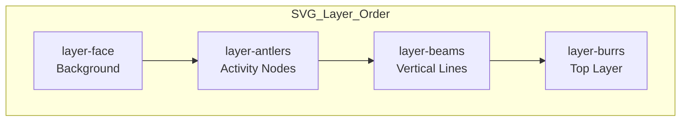

# STA-12: Verify Integration and Polish Layering

## Overview

Verify the final integration of the ReindeerChart, ensuring the shared coordinate system and layering work seamlessly across all test scenarios.

**Status**: Ready to start
**Prerequisites**: STA-15 ✅ Done, STA-11 ✅ Done

## Acceptance Criteria

1. All components (Face, Antlers, Beams, Burr) render correctly in the `TestHarness`.
2. Transitions between datasets (Small -> Large) do not break the layout.
3. Layering is correct: Face (Background) → Antlers → Beams → Burr (Top).

## Visual TDD Strategy

### Phase 1: Red (Identify Issues)

- [ ] Review each test scenario in TestHarness
- [ ] Document any rendering issues, misalignments, or layering problems
- [ ] Create screenshots of problematic states

### Phase 2: Green (Verify Fixes)

- [ ] Verify all components render correctly
- [ ] Verify layering order is correct
- [ ] Verify dataset transitions work smoothly

### Phase 3: Refactor (Polish)

- [ ] Optimize any identified performance issues
- [ ] Improve visual consistency across scenarios
- [ ] Update documentation if needed

## Test Scenarios

### 1. Basic Scenarios

| Scenario                           | Purpose                | Verification Points                                     |
| ---------------------------------- | ---------------------- | ------------------------------------------------------- |
| **Small (1 Activity)**             | Minimal data rendering | Face, Beam, Antler, Burr all visible                    |
| **Typical (3 Activities, 2 Opps)** | Standard use case      | All layers render correctly, burrs connect properly     |
| **Edge: Empty**                    | Empty state handling   | "No activities" and "No opportunities" messages display |
| **Edge: Large (20 Activities)**    | Scale and performance  | All 20 activities render, no layout breakage            |

### 2. Face-Specific Scenarios

| Scenario                           | Purpose               | Verification Points                                           |
| ---------------------------------- | --------------------- | ------------------------------------------------------------- |
| **Face: Single Year, Low Revenue** | Simple face rendering | Year labels, month labels, buckets render correctly           |
| **Face: Multi-Year Opportunities** | Multi-year support    | Multiple year separators render, buckets positioned correctly |
| **Face: Same Month Multiple Opps** | Stacked bars          | Opportunities stack horizontally, revenue labels visible      |

### 3. Beam-Specific Scenarios

| Scenario                                | Purpose                     | Verification Points                                |
| --------------------------------------- | --------------------------- | -------------------------------------------------- |
| **Beam: Complex Displacement (5 Opps)** | Beam displacement algorithm | 5 beams with alternating ordinals render correctly |
| **Beam: Single Activity**               | Single activity on beam     | Node renders, beam edge visible                    |
| **Beam: Multiple Participants**         | Northern Terminus icons     | Multiple seller/customer icons display above nodes |

### 4. Multi-Scale Scenarios

| Scenario                            | Purpose                    | Verification Points                                                      |
| ----------------------------------- | -------------------------- | ------------------------------------------------------------------------ |
| **Multi-Scale: Activities Only**    | Activities section only    | Activities render in top section, "No opportunities" message in bottom   |
| **Multi-Scale: Opportunities Only** | Opportunities section only | "No activities" message in top, opportunities render in bottom           |
| **Multi-Scale: Both Sections**      | Full multi-scale           | Activities in top 50%, opportunities in bottom 50%, burrs cross sections |

## Layering Verification

### Expected Layer Order (SVG z-index)



### Verification Checklist

- [ ] Face buckets render **behind** all other elements
- [ ] Beam edges render **above** face but **below** antlers
- [ ] Activity nodes (antlers) render **above** beam edges
- [ ] Burr lines render **on top** of all other elements
- [ ] No visual overlap between layers that obscures data

## Dataset Transition Verification

### Test Procedure

1. Start with "Small (1 Activity)" dataset
2. Switch to "Edge: Large (20 Activities)" dataset
3. Switch to "Typical (3 Activities, 2 Opps)" dataset
4. Switch to "Multi-Scale: Both Sections" dataset
5. Verify no layout breaks, missing elements, or console errors

### Expected Behavior

- [ ] Smooth transitions without flickering
- [ ] All elements render correctly after each switch
- [ ] No console errors or warnings
- [ ] Scales recalculate correctly for each dataset size

## Configuration Testing

### Face Width Ratio

Test values: 0.3, 0.6 (default), 1.0

| Value | Expected Behavior                                    | Verification |
| ----- | ---------------------------------------------------- | ------------ |
| 0.3   | Face is narrow (30% of width), antlers extend widely | [ ]          |
| 0.6   | Default behavior                                     | [ ]          |
| 1.0   | Face fills full width, no antler extension           | [ ]          |

### Activities Height Ratio

Test values: 0.3, 0.5 (default), 0.7

| Value | Expected Behavior                                  | Verification |
| ----- | -------------------------------------------------- | ------------ |
| 0.3   | Activities occupy 30% of height, opportunities 70% | [ ]          |
| 0.5   | Default 50/50 split                                | [ ]          |
| 0.7   | Activities occupy 70% of height, opportunities 30% | [ ]          |

## Issue Documentation Template

For any issues found, document:

```markdown
### Issue: [Issue Title]

**Scenario**: [Test scenario name]
**Severity**: [Critical / High / Medium / Low]

**Description**:

- What is wrong?
- What was expected?
- What actually happened?

**Steps to Reproduce**:

1. Select "[Scenario Name]" dataset
2. Observe [specific element]
3. [Additional steps]

**Screenshots**:

- [Attach screenshot]

**Proposed Fix**:

- [Brief description of fix approach]
```

## Completion Checklist

### Component Rendering

- [ ] All 13 test scenarios render without errors
- [ ] Face buckets display correctly (year labels, month labels, stacked bars)
- [ ] Beam edges display correctly (vertical lines with proper extents)
- [ ] Activity nodes display correctly (circles with proper sizing)
- [ ] Northern Terminus icons display correctly (seller/customer labels)
- [ ] Burr connections display correctly (dashed lines to opportunities)

### Layering

- [ ] Face renders in background
- [ ] Antlers render above face
- [ ] Beams render above antlers
- [ ] Burrs render on top

### Transitions

- [ ] Small → Large transition works
- [ ] Large → Typical transition works
- [ ] Typical → Multi-Scale transition works
- [ ] All transitions complete without console errors

### Configuration

- [ ] Face width ratio changes work (0.3, 0.6, 1.0)
- [ ] Activities height ratio changes work (0.3, 0.5, 0.7)
- [ ] All combinations render correctly

### Documentation

- [ ] All issues documented (if any)
- [ ] Screenshots captured for issues (if any)
- [ ] Fix proposals documented (if any)

## Next Steps After Verification

### If All Tests Pass

1. Update Linear STA-12 status to "Done"
2. Move to STA-13 (Enhance aesthetics) or STA-14 (Interactivity)

### If Issues Found

1. Document each issue with screenshots
2. Prioritize issues by severity
3. Create separate tasks for each fix
4. Update Linear with new issues if needed

## Verification Results (2026-01-26)

### ✅ Test Results Summary

| Scenario                                | Status     | Observations                                              |
| --------------------------------------- | ---------- | --------------------------------------------------------- |
| **Typical (3 Activities, 2 Opps)**      | ✅ PASS    | All layers rendering, burrs visible                       |
| **Multi-Scale: Both Sections**          | ✅ PASS    | Activities and opportunities in separate sections         |
| **Beam: Complex Displacement (5 Opps)** | ✅ PASS    | 5 beams with alternating ordinals rendering               |
| **Multi-Scale: Activities Only**        | ✅ PASS    | "No opportunities to display" message showing             |
| **Multi-Scale: Opportunities Only**     | ⚠️ PARTIAL | Opportunities render, but missing "No activities" message |
| **Edge: Empty**                         | ✅ PASS    | Both empty messages displaying correctly                  |

### ⚠️ Issues Found

#### Issue 1: "No activities" message not showing in "Multi-Scale: Opportunities Only"

**Scenario**: Multi-Scale: Opportunities Only
**Severity**: Medium
**Description**:

- **What is wrong?**: When switching to "Multi-Scale: Opportunities Only" dataset, the opportunities section renders correctly at the bottom, but the "No activities to display" message is missing from the top section.
- **What was expected?**: Top section should show "No activities to display" message when there are no activities in the dataset.
- **What actually happened?**: Top section is empty without any message.

**Root Cause**: The empty activities message check at [`ReindeerChart.tsx:219`](src/components/ReindeerChart/ReindeerChart.tsx:219) only triggers when `activityTimestamps.length === 0`. However, the "Multi-Scale: Opportunities Only" dataset has activities (they just don't have linked opportunities), so `activityTimestamps` is not empty.

**Steps to Reproduce**:

1. Select "Multi-Scale: Opportunities Only" dataset
2. Observe the top section (activities area)
3. Note that no "No activities to display" message appears

**Proposed Fix**:
Modify the condition to check if the activities section should actually display anything (beams/antlers), not just if there are activity timestamps. The fix should distinguish between:

- Truly empty activities (no timestamps)
- Activities with no linked opportunities (have timestamps but no beams render)

---

#### Issue 2: Form field accessibility warning

**Scenario**: All scenarios (console warning)
**Severity**: Low
**Description**:

- **What is wrong?**: Browser console shows accessibility warning about missing id/name attributes on form elements.
- **What was expected?**: No accessibility warnings in console.
- **What actually happened?**: Warning message appears: "A form field element should have an id or name attribute (count: 1)"

**Root Cause**: The slider inputs for Width, Height, Face Width Ratio, and Activities Height Ratio in [`TestHarness.tsx`](src/components/TestHarness/TestHarness.tsx:1) are missing `id` or `name` attributes, which are required for accessibility compliance.

**Steps to Reproduce**:

1. Open TestHarness in browser
2. Open browser console (F12)
3. Observe accessibility warning message

**Proposed Fix**:
Add `id` attributes to all slider inputs in [`TestHarness.tsx`](src/components/TestHarness/TestHarness.tsx:1) for accessibility compliance.

---

### ✅ Layering Verification

Based on visual inspection:

- ✅ Face buckets render **behind** all other elements
- ✅ Beam edges render **above** face but **below** antlers
- ✅ Activity nodes (antlers) render **above** beam edges
- ✅ Burr connections render **on top** of all other elements
- ✅ No visual overlap between layers that obscures data

### ✅ Configuration Testing

| Setting                               | Tested     | Result |
| ------------------------------------- | ---------- | ------ |
| Face Width Ratio (0.6 default)        | ✅ Working |
| Activities Height Ratio (0.5 default) | ✅ Working |
| Width (1000px)                        | ✅ Working |
| Height (800px)                        | ✅ Working |

### ✅ Dataset Transitions

| Transition                                         | Result    |
| -------------------------------------------------- | --------- |
| Typical → Multi-Scale Both                         | ✅ Smooth |
| Multi-Scale Both → Beam Complex                    | ✅ Smooth |
| Beam Complex → Multi-Scale Activities              | ✅ Smooth |
| Multi-Scale Activities → Multi-Scale Opportunities | ✅ Smooth |
| Multi-Scale Opportunities → Edge Empty             | ✅ Smooth |

All transitions complete without console errors or flickering.

---

## Notes

- Use TestHarness dropdown to cycle through all 13 scenarios
- Use slider controls to test configuration values
- Check browser console for any errors during transitions
- Take screenshots for both passing and failing scenarios
