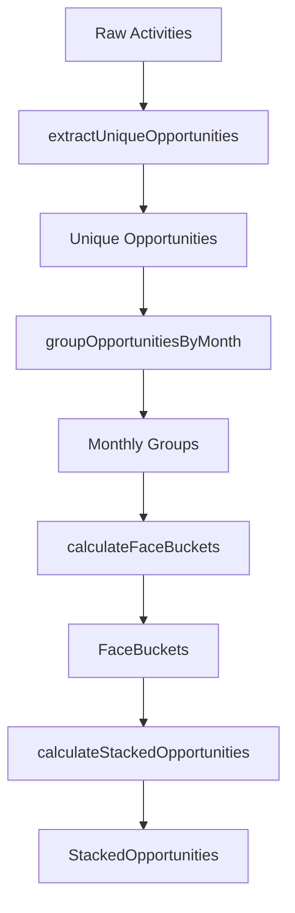

# Implementation Plan - STA-7: Data Aggregation for the Face

Implement pure logic functions to transform raw activity/opportunity data into the `FaceBucket` and `StackedOpportunity` models required for the "Face" (background) layer of the Reindeer visualization.

## User Review Required

> [!IMPORTANT]
> I am adding an optional `id` field to the `Opportunity` interface in `src/types/reindeer.ts`. This is necessary to correctly deduplicate opportunities that may be linked to multiple activities.

- Does adding an `id` to `Opportunity` align with how your data is structured?
- **CONFIRMED**: The logic will support flexible bucket periods (monthly or quarterly) via a `bucketPeriod` parameter.

## Proposed Changes

### 1. Types Update

- Update `Opportunity` in [`src/types/reindeer.ts`](src/types/reindeer.ts) to include `id: string`.

### 2. Data Transformation Logic

Create [`src/utils/faceAggregation.ts`](src/utils/faceAggregation.ts) with the following functions:

- `extractUniqueOpportunities(activities: Activity[]): Opportunity[]`
  - Deduplicates opportunities based on `id`.
- `groupOpportunitiesByPeriod(opportunities: Opportunity[], period: 'month' | 'quarter'): Map<string, Opportunity[]>`
  - Groups opportunities by period key derived from `closeDate`.
  - For 'month': "YYYY-MM"
  - For 'quarter': "YYYY-QX"
- `calculateFaceBuckets(groupedData: Map<string, Opportunity[]>, layout: { rowHeight: number, maxWidth: number }): FaceBucket[]`
  - Sorts buckets chronologically.
  - Calculates `totalRevenue` for each bucket.
  - Assigns `yPosition` based on index and `rowHeight`.
- `calculateStackedOpportunities(buckets: FaceBucket[]): StackedOpportunity[]`
  - Maps each bucket's opportunities to `StackedOpportunity`.
  - Calculates `width` as `(opp.revenue / bucket.totalRevenue) * bucket.maxWidth`.
  - Calculates `xPosition` using a cumulative offset within the bucket.

### 3. Verification (Visual TDD Prep)

- Update [`src/components/TestHarness/mockData.ts`](src/components/TestHarness/mockData.ts) to include `id` fields for all opportunities.

## TODO List

- [ ] Add `id` to `Opportunity` interface in `src/types/reindeer.ts`
- [ ] Create `src/utils/faceAggregation.ts` and implement `extractUniqueOpportunities`
- [ ] Implement `groupOpportunitiesByMonth` in `src/utils/faceAggregation.ts`
- [ ] Implement `calculateFaceBuckets` in `src/utils/faceAggregation.ts`
- [ ] Implement `calculateStackedOpportunities` in `src/utils/faceAggregation.ts`
- [ ] Update `src/components/TestHarness/mockData.ts` with opportunity IDs
- [ ] Verify logic via unit tests (if configured) or prepare for Visual TDD in next task

## Mermaid Diagram

